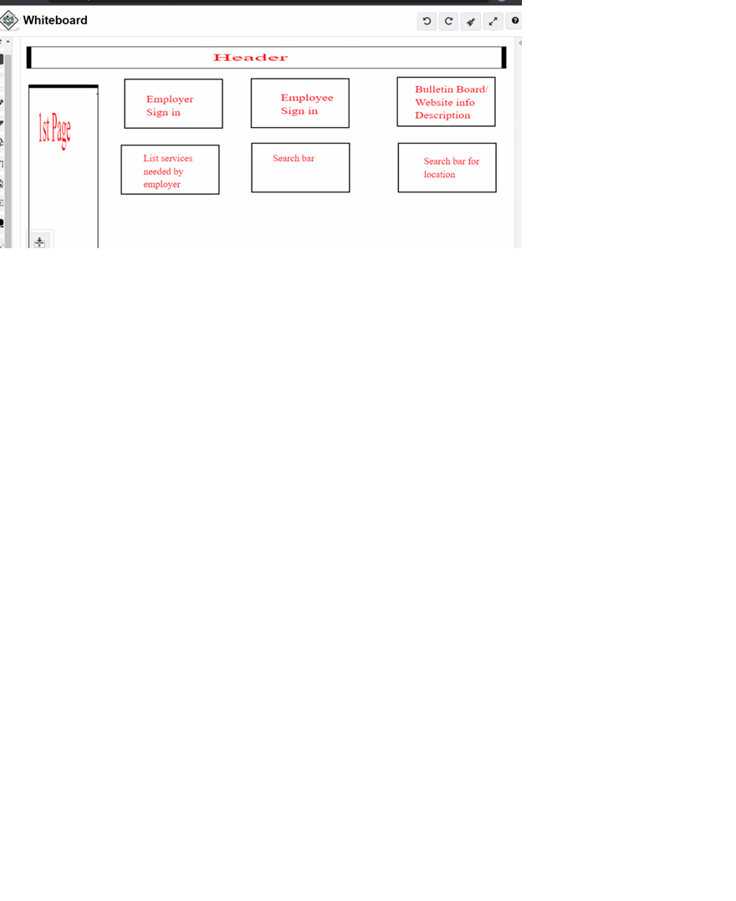

# Project Planning
For this assignment, you'll create some initial plans for your project.

## Assignment Description
[Project Planning Assignment](https://education.launchcode.org/liftoff/modules/assignments/project-planning)
Our website is for an online home service in which a customer can reach a professional for their need and vice versa.
There will be a customer sign in and a pro sign in, so they can provide information about their needs 
There also will be a bulletin where jobs can be posted
THe customer and the pro can contact each other via the app as well. 

## Submission Instructions

### Wireframes

Include at least 3 wireframes here, adding images or files to your repository as necessary. Format them as a bulleted/unordered list with links to the files.
<!DOCTYPE html>
<html>
<head>Wireframes</head>
<body>

<ul>
<li></li>
<li></li>
<li></li>
</ul>
</body>
</html>
### Project Tracker

Include a link to your public Trello board. Be sure you have user stories added for at least your first 2-week sprint.
https://trello.com/b/vXpUY8an/capstone-project-codergirl

### Project Repo Link

Include a link to your project on GitHub.
https://github.com/KhadijaB88/Kaboodles
